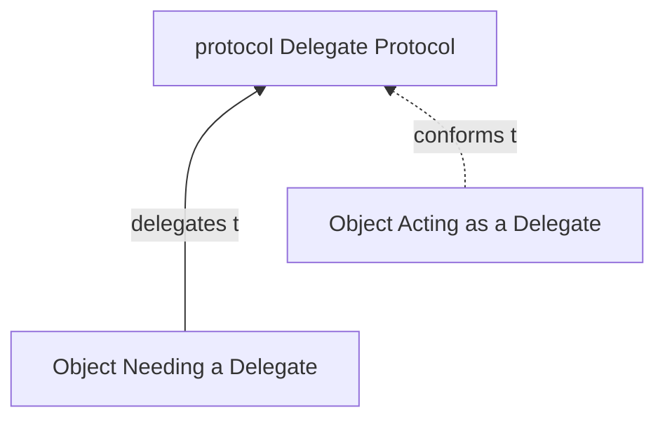
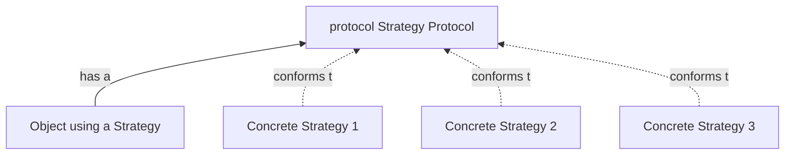
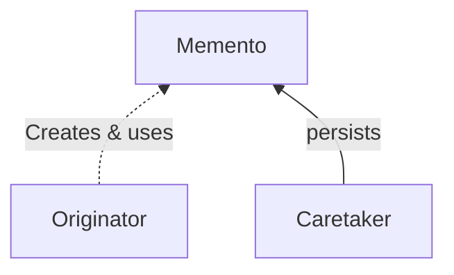
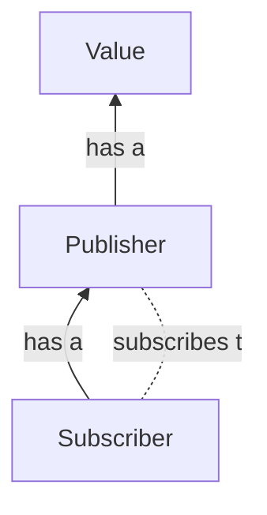
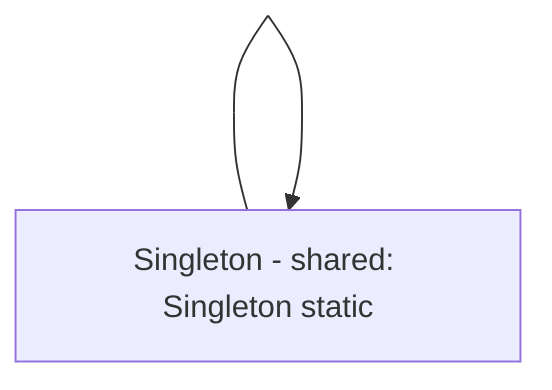
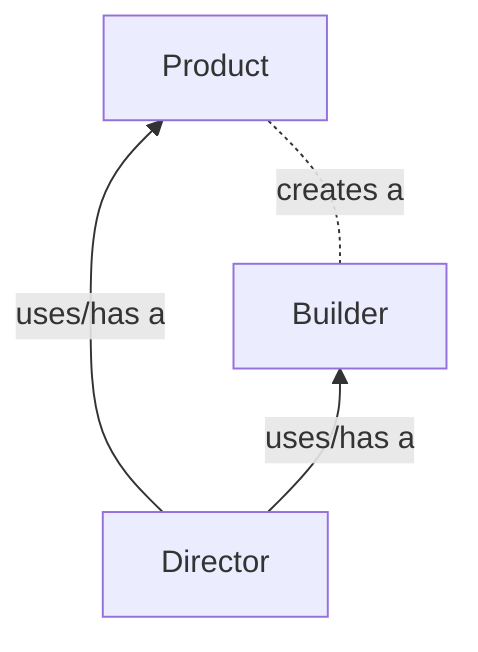

# Rabble-Wabble

An app to learn design patterns in Swift "comprehensively"!

Credits: Design Patterns by Tutorials by Joshua Greene & Jay Strawn
RayWenderlich.com

# Fundamental Design Patterns

## Behavioral Patterns: 
Classified on how objects **communicate** with each other

### Delegation Pattern
In short, the delegation pattern enables an object to use a "helper" to provide data or perform tasks rather than do the task itself. examples of Delegation protocols in UIKit: `UITableViewDataSource`, `UITableViewDelegate`.

Learn More

 

**Steps**

 Inside the class (say `OwnerClass`) that owns the protocol.
 1. Define a `protocol` over the class/object that needs to hand off control. `OwnerClassDelegate`
 2. Declare the `delegate` inside the class as optional. eg: `public weak var delegate: OwnerClassDelegate?`
 3. Call the protocol methods from within the class appropriately.
 
 Inside the class (say `SuperClass`) that confirms to the protocol.
 1. Assign the `delegate` variable of `OwnerClass` to self.
 2. Confirm the `SuperClass` to the `OwnerClassDelegate` .
 3. Define the protocol methods inside.

**Notes**: 

 - The delegates should be weak properties mostly.
 - Delegation Pattern helps in creating modular reusable components.

### Strategy Pattern
In short, the strategy pattern defines a family of interchangeable objects that can be interchanged at run time. e.g.: consider an app that uses several food rating services like yelp or google. Instead of writing if-else statements inside the controller after a user has picked what service they want to use for viewing the food review. We can define a common API (a `Strategy` essentially a `Protocol` for all different services)

Three parts: object using the strategy, the strategy protocol, and a family of strategy objects (that conform to the strategy protocol).

Learn More

 

**Steps**

 1. Define a Strategy `protocol` that defines all the items a Strategy must conform to. say `FoodReviewStrategy`
 2. Conform to this strategy using the different objects (strategies) in your mind. In the case of food reviews, this may be a `GoogleReviewStrategy` or `YelpReviewStrategy`
 3. Use these strategies interchangeably in your main class (VC) depending on user selection or for A/B testing.

**Notes**: 

 - Similar to the delegation pattern, both use protocol. However, strategies are meant to be switched at runtime, whereas delegates are usually fixed.
 - Try not to overuse this pattern. The trick to the pattern is to realize when to pull behaviors out from the mainVC into a strategy protocol. 

### Memento Pattern
In short, the memento pattern allows an object to be saved and restored. Use this pattern whenever you want to save and restore an object's state.
Three parts: (imagine a Game)
1. Originator (this is the class which saves and retrieves data, say the Game Screen itself)
2. Memento (this is the saved game (saved data))
3. Care Taker (this is the class reponsible for saving the data from originator into memento and retrieving data back from memento and giving it to the originator)

Learn More

 

**Steps**
1. Create Model to be saved (say Score)
2. Create a caretaker that saves (encodes) & retrieves (decodes) data from the saved state (memento; could be a `json` file in the app).
3. Use this caretaker to save and retrieve data from the originator.

**Notes**: 

 - Be careful while using the `Codable` protocol, always safely unwrap the data to the model and vice versa.
 - Plan ahead when changing models as the save data might not be up to date with the new structure. Try using an upgrade path to convert from old to new data, *versioning models + using a versioned database should help too*.

### Observer Pattern **important**
This pattern is now supported in Swift 5.1 natively under the Combine framework. Very Powerful and Useful. In short, this pattern lets one object observe the changes on another object.

Learn More

 

**Steps**

 1. `import Combine` obviously.
 2. Create the variables inside the Model that needs to be Published using `@Published` keyword.
 3. Subscribe to the changes on this variable using an `AnyCancellable` object. This subscription now starts observing and any changes made to the published variable will run some code implemented in this subscriber's completion block.

**Notes**: 

 - Make sure the value is required to be observed and will change before using `@Published`.
 - `@Published` only works on `classes` and `var` variables.
 - You can access the publisher object of a variable by placing a `$` before the variable. eg: `$xyz`
 - `.sink` returns a type of `AnyCancellable` and if this is explicitly marked as optional then by making the obejct nil the subscription ends.

## Creational Patterns: 
Classified on how objects are **created**

### Singleton Pattern
In short, the singleton pattern restricts the class to only one instance. Extremely common. 
Singleton Plus pattern is also common, that allows creation of other instances of the Singleton (simply make the init public instead of private like in the Singleton). 

**Important** Singletons are problematic for testing for two reasons 
- if there is state being stored in a global object like a singleton then the order of the tests starts to matter 
- and, they are very painful to mock. 

Learn More

 

**Steps**

 Inside the class (say `OwnerClass`) that owns the protocol.
 1. Create a class and then create an instance of the same class inside itself.
 2. Create a `private init` inside this class for a true singleton and a `public init` for a SingletonPlus.
 3. Use throughout the app.

**Notes**: 

 - Very easy to overuse and misuse. Make sure there is no other way of doing what you are trying to do before using a Singleton. 
 - Saving UserSettings is one use-case.

### Builder Pattern 
Another creation-al pattern, that deals with creating complex objects. Has three parts, the Director (usually a ViewController), a Product (either a `class` or a `struct`; essentially an object model) and a Builder which Handles creation of the object (often a class).

Learn More

 

**Steps**

 Inside the class (say `OwnerClass`) that owns the protocol.
 1. Create a Builder class, that aligns with the object you're trying to build and give the properties default values.
 2. Create a `build()` method that throws if the properties are not assigned correctly; this method returns the Object (product) being created.
 3. Use the Builder to create your object and then assign.

**Notes**: 

When should you not use Builder Pattern? 
Works best when you're trying to create a complex object which requires input using a series of steps. If the logic does not involve a series of inputs it is best not to use the Builder Pattern. 

# Intermediate Design Patterns

coming soon...

## MVVM - Model View ViewModel Pattern
## Factory Pattern
## Adapter Pattern
## Iterator Pattern
## Prototype Pattern
## State Pattern
## Multicast Delegate Pattern
## Facade Pattern

### Side Notes

- Codable - Any type that conforms to `Codable` **can convert itself into and out of an external representation** (eg. JSON). Behind the scenes, `Codable` is a typealias that combines `Encodable` and `Decodable`.
- `final` - when put before class declaration, the class cannot be sub-classed. When put before a method declaration the method cannot be overridden.
- `static` - By declaring properties and methods as `static`, Swift allocates them directly into the object’s memory, making it available for use without the need of an instance. Enables the Singleton pattern where the object creates an static instance of itself inside of itself.
- `atomic` - swift properties are non-atomic by default. An operation is atomic if it appears to the rest of the system to occur at a single instant without being interrupted, it guarantees a value inside of it. Though it has a small performance cost, it ensures that the data is not corrupted.
- `private(set)` - restricts outside classes from setting the variable directly from outside the class, instead these properties can be set using public setter methods. You can set the variables privately and use them publicly by defining them as `public private(set)`.
- Good idea to always make UI calls on the main thread `DispatchQueue.main`.

// TODO: 
- `OptionSet` & difference between array and option setting
- `Storyboard Reference` to segregate views when using a storyboard approach.

