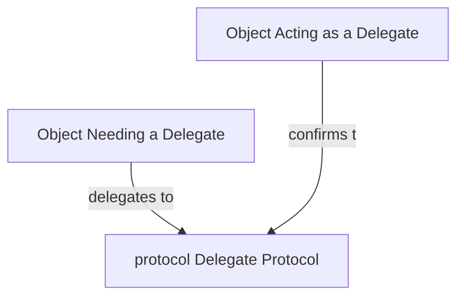
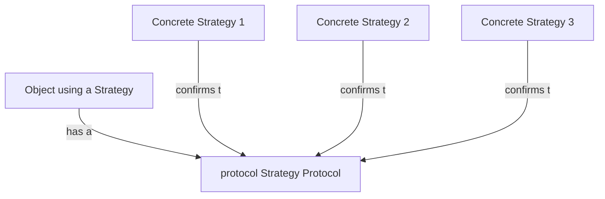

# Rabble-Wabble

An app to learn design patterns in Swift "comprehensively"!

## Fundamental Design Patterns

## Behavioral Patterns: 
Classified on how objects **communicate** with each other

### Delegation Pattern
In short, the delegation patterns enables an object to use a "helper" to provide data or perform tasks rather than do the task itself. examples of Delegation protocols in UIKit: `UITableViewDataSource`, `UITableViewDelegate`.

Learn More

 

**Steps**

 Inside the class (say `OwnerClass`) that owns the protocol.
 1. Define a `protocol` over the class/object that needs to hand off control. `OwnerClassDelegate`
 2. Declare the `delegate` inside the class as optional. eg: `public weak var delegate: OwnerClassDelegate?`
 3. Call the protocol methods from within the class appropriately.
 
 Inside the class (say `SuperClass`) that confirms to the protocol.
 1. Assign the `delegate` variable of `OwnerClass` to self.
 2. Confirm the `SuperClass` to the `OwnerClassDelegate` .
 3. Define the protocol methods inside.

**Notes**: 

 - The delegates should be weak properties mostly.
 - Delegation Pattern helps in creating modular reusable components.

### Strategy Pattern
In short, the strategy pattern defines a family of interchangeable objects that can be interchanged at run time. e.g.: consider an app that uses several food rating services like yelp or google. Instead of writing if-else statements inside the controller after a user has picked what service they want to use for viewing the food review. We can define a common API (a `Strategy` essentially a `Protocol` for all different services)

Three parts: object using the strategy, the strategy protocol, and a family of strategy objects (that conform to the strategy protocol).

Learn More

 

**Steps**

 1. Define a Strategy `protocol` that defines all the items a Strategy must conform to. say `FoodReviewStrategy`
 2. Conform to this strategy using the different objects (strategies) in your mind. In the case of food reviews, this may be a `GoogleReviewStrategy` or `YelpReviewStrategy`
 3. Use these strategies interchangeably in your main class (VC) depending on user selection or for A/B testing.

**Notes**: 

 - Similar to the delegation pattern, both use protocol. However, strategies are meant to be switched at runtime, whereas delegates are usually fixed.
 - Try not to overuse this pattern. The trick to the pattern is to realize when to pull behaviors out from the mainVC into a strategy protocol. 

