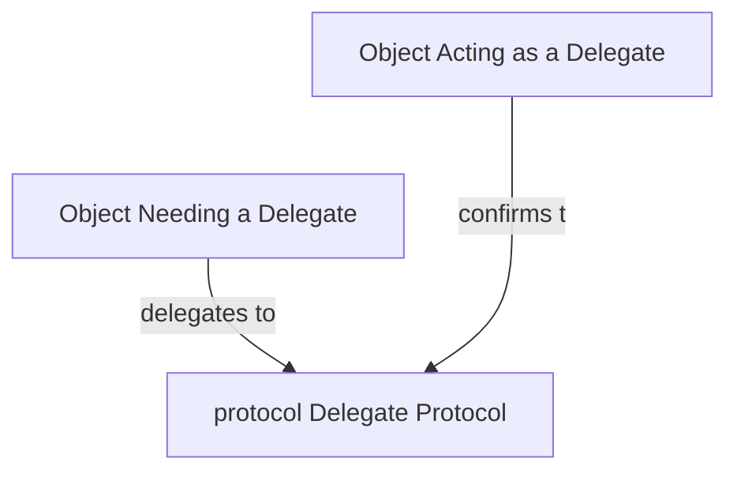

# Rabble-Wabble

An app to learn design patterns in Swift "comprehensively"!

## Fundamental Design Patterns

### Delegation Pattern
In short, the delegation patterns enables an object to use a "helper" to provide data or perform tasks rather than do the task itself. examples of Delegation protocols in UIKit: `UITableViewDataSource`, `UITableViewDelegate`.

Learn More

 

**Steps**

 Inside the class (say `OwnerClass`) that owns the protocol.
 1. Define a `protocol` over the class/object that needs to hand off control. `OwnerClassDelegate`
 2. Declare the `delegate` inside the class as optional. eg: `public weak var delegate: OwnerClassDelegate?`
 3. Call the protocol methods from within the class appropriately.
 
 Inside the class (say `SuperClass`) that confirms to the protocol.
 1. Assign the `delegate` variable of `OwnerClass` to self.
 2. Confirm the `SuperClass` to the `OwnerClassDelegate` .
 3. Define the protocol methods inside.

**Notes**: 

 - The delegates should be weak properties mostly.
 - Delegation Pattern helps in creating modular reusable components.

